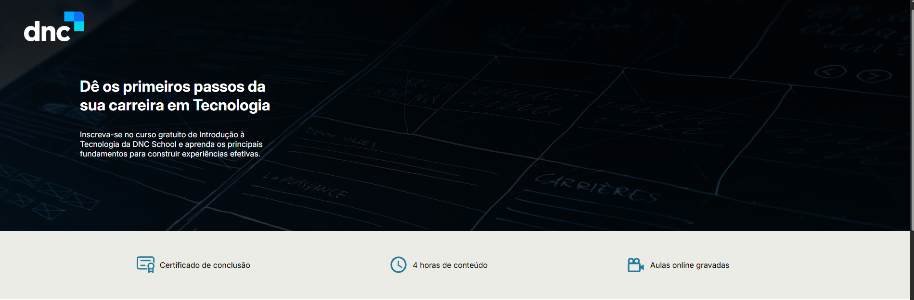
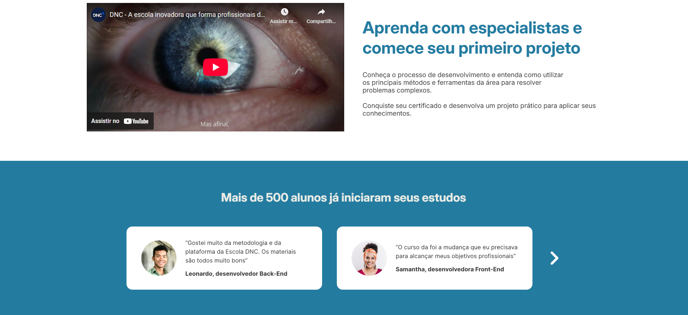
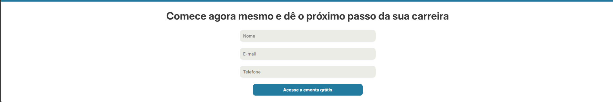

<h1 align="center" style="font-weight: bold;">Landin Page DNC 💻</h1>

 <a href="#tech">Technologies</a> • 
 <a href="#started">Getting Started</a> • 

    <b>Customer acquisition landing page for DNC school</b>

     <a href="PROJECT__URL">📱 https://thalesfortes.github.io/landing-page/ </a>

<h2 id="layout">🎨 Layout</h2>

    
    
    

<h2 id="technologies">💻 Technologies</h2>

- HTML5
- CSS3

<h2 id="started">🚀 Getting started</h2>

Just download the project with its assets and run it with liveserve or just by opening the html document
